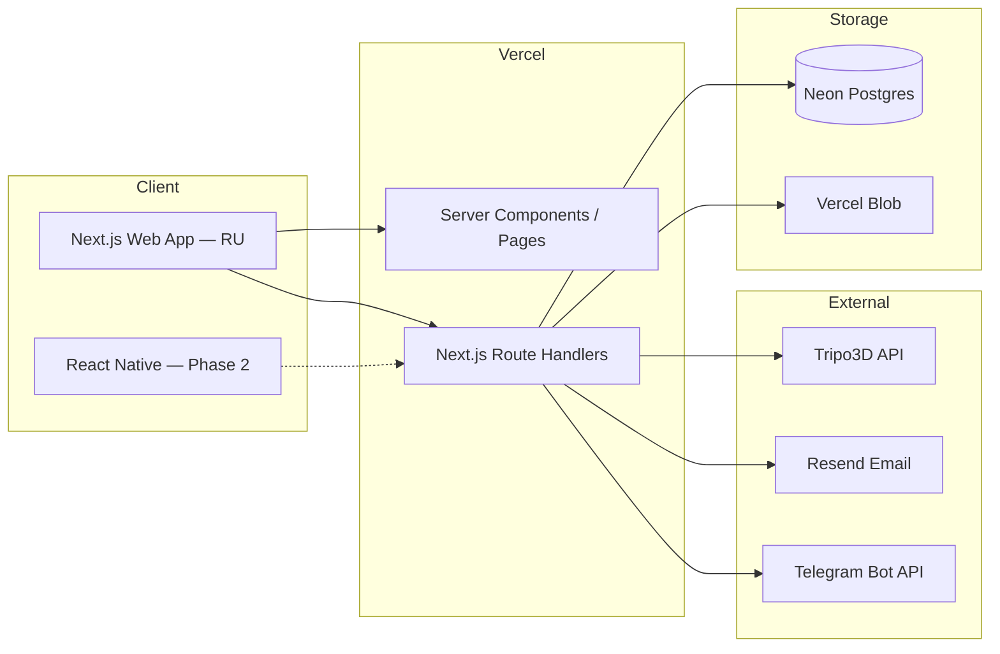

# 03 — Architecture

## Stack

| Layer | Choice | Notes |
|---|---|---|
| Frontend | Next.js (App Router) + React + TypeScript + Tailwind CSS | Single repo, full-stack |
| Fonts | Inter (body, sans) + Onest (display, headings) — both with Latin + Cyrillic via `next/font/google` | Self-hosted, FOIT-free |
| Theming | Light + dark; auto via `prefers-color-scheme`, manual override class hooks ready | Brand primary `#fe017e` |
| 3D | Three.js + react-three-fiber + drei | GLB models, Draco + KTX2 |
| Backend | Next.js Route Handlers | No separate backend |
| Database | Neon (serverless Postgres) + Prisma ORM | Branching for staging |
| Storage | Vercel Blob | Photos + generated `.glb` files |
| Auth | Auth.js (NextAuth v5) — Credentials provider | Separate user + admin login |
| Email | Resend | RU templates |
| Push to admin | Telegram Bot API | Instant alerts to studio owner |
| 3D generation | Provider abstraction (Tripo3D primary, manual upload fallback) | Easy to swap |
| Hosting | Vercel | Hobby tier sufficient |
| Cron | Vercel Cron | Polls in-flight 3D-generation jobs |

## High-level diagram

## Why this stack

- **Lowest friction for solo dev:** single repo, single deploy, free tiers cover the studio's scale indefinitely.
- **Neon's branching feature** lets us spin up a staging DB per PR with no setup.
- **Same Route Handler API** will serve the future React Native app without changes — design APIs to be transport-agnostic.
- **Vercel Blob** is zero-config inside Next.js and integrates with Vercel deploys out of the box.
- **Provider abstraction** for 3D generation means swapping Tripo3D for another managed API or self-hosted setup later is a config change, not a rewrite.

## Environment variables (planned)

| Variable | Purpose |
|---|---|
| `DATABASE_URL` | Neon pooled connection (used at runtime) |
| `DIRECT_URL` | Neon direct connection (used by Prisma migrations) |
| `BLOB_READ_WRITE_TOKEN` | Vercel Blob |
| `AUTH_SECRET` | Auth.js JWT secret |
| `RESEND_API_KEY` | Resend |
| `RESEND_FROM_EMAIL` | Verified sender address |
| `TELEGRAM_BOT_TOKEN` | Bot identity (admin chat id is stored in DB `Settings`) |
| `TRIPO3D_API_KEY` | Primary 3D-generation provider |
| `DRY_RUN_3D_GEN` | Set to `1` to short-circuit auto-3D pipeline (no API calls, demo GLB) — dev-only |
| `ADMIN_SEED_EMAIL` | One-time admin user seed |
| `ADMIN_SEED_PASSWORD` | One-time admin user seed |

## Deployment

- One Vercel project tracking the `main` branch.
- Neon DB connected via `DATABASE_URL` / `DIRECT_URL`.
- Vercel Blob bound automatically (`BLOB_READ_WRITE_TOKEN` injected).
- Resend domain verified for the sender address.
- Telegram bot created via @BotFather; admin gets their own `chat_id` and pastes it into `/admin/settings`.
- Vercel Cron entry for `/api/cron/poll-jobs` running every minute.
