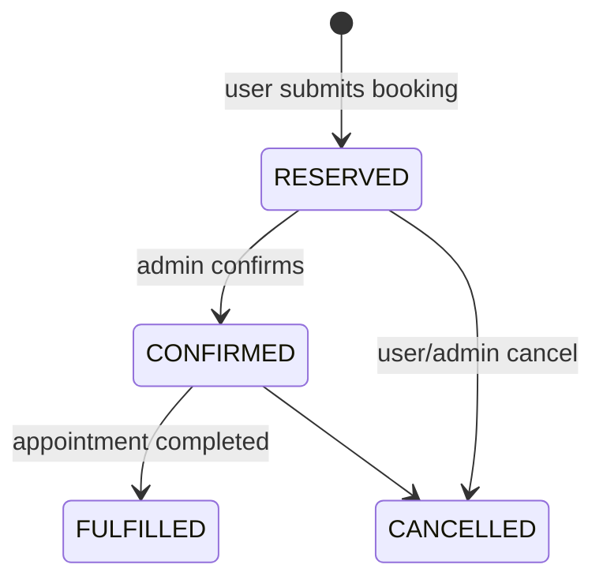
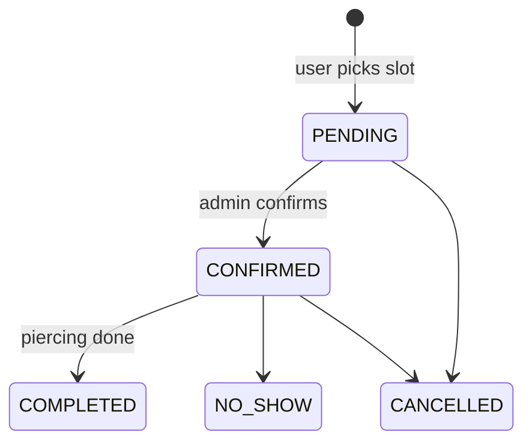
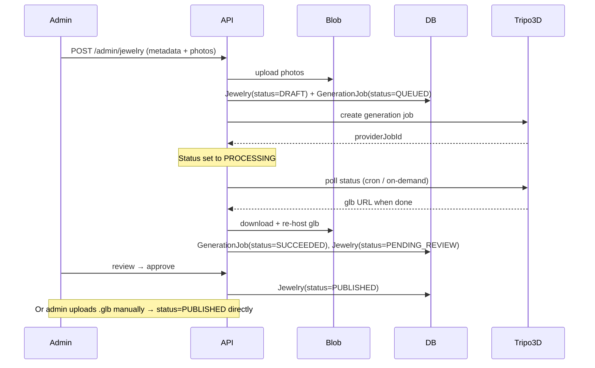

# 06 — Flows

## Booking-state diagram

`JewelryBooking.status` transitions:



**Notes:**
- `RESERVED` is the initial soft-reservation state. `Jewelry.inStock` is decremented at the moment of reservation.
- On `CANCELLED`, `Jewelry.inStock` is incremented back (only if it had been decremented for that booking — i.e., not double-incremented).
- `FULFILLED` is set automatically when the linked `Appointment` transitions to `COMPLETED`.
- **Multiple `JewelryBooking` rows can share one `Appointment`.** Each booking has its own status; status transitions are per-booking but admin actions on the parent appointment can cascade to all linked bookings (e.g., `COMPLETED` → all linked bookings become `FULFILLED`).

## Appointment-state diagram

`Appointment.status` transitions:



**Notes:**
- A `PENDING` appointment still occupies its `AvailabilitySlot` (the slot's 1-to-1 link is set), so the slot is hidden from the public picker.
- On `CANCELLED`, the `AvailabilitySlot` link is cleared so the slot becomes pickable again.

## Auto-3D generation sequence



## Booking flow (textual)

The `/book` page is a single stepper that handles three scenarios — jewelry-only, appointment-only, and combined. The flow:

1. **Purpose.** User picks one of: `Запись на услугу`, `Бронь украшения`, `И то, и другое`.
2. **Optional jewelry pick.** If jewelry is involved, user multi-selects published, in-stock pieces from the catalog (search/filter). Deep-link `?items=jewelryId1,jewelryId2,...` from the showroom (`/catalog`), the detail page (`/catalog/[id]`), or the storytelling landing skips this step and pre-fills the selection.
3. **Optional slot pick.** If an appointment is involved, user picks an open `AvailabilitySlot`.
4. **Contact details.** Name, email, phone, optional notes. Pre-filled if signed in.
5. **Confirm.** Submit.

On submit, a single server action runs in a Prisma transaction:

```
- Upsert User by email (isGuest=true if not signed in, isGuest=false if signed in).
- For each chosen jewelry (one or many):
    - SELECT Jewelry FOR UPDATE; if inStock < quantity → reject the entire transaction with a friendly RU error.
    - Create JewelryBooking(status=RESERVED).
    - Decrement Jewelry.inStock.
- If appointment path:
    - SELECT AvailabilitySlot; ensure isOpen=true and no Appointment attached.
    - Create Appointment(status=PENDING) linked to slot.
    - Set appointmentId on every JewelryBooking created above (combined flow).
- Send notifications (Resend email to user + admin, Telegram to admin) summarizing all bookings.
- Redirect to /book/success with a summary.
```

The transaction guarantees no over-booking of stock or slots even under concurrent submissions.

## Combined jewelry + appointment scenario

When the user picks `И то, и другое`:
- A single `Appointment` is created.
- One `JewelryBooking` is created **per chosen jewelry**, each with `appointmentId` set to the new appointment.
- Status moves through both state machines independently:
  - When admin confirms the appointment, all linked bookings can be confirmed in one click (admin-side bulk action in the panel).
  - When the appointment is `COMPLETED`, every linked booking auto-transitions to `FULFILLED`.
  - If the appointment is `CANCELLED`, each linked booking is offered to be cancelled or kept (admin choice, per booking).

## Stock decrement atomicity

`Jewelry.inStock` is mutated only inside the booking transaction. The order of operations is:

1. `SELECT inStock FROM Jewelry WHERE id = ? FOR UPDATE` (Prisma `$transaction` with row-level lock).
2. If `inStock < requestedQuantity`, abort the transaction and return a friendly error.
3. `UPDATE Jewelry SET inStock = inStock - quantity WHERE id = ?`.
4. `INSERT INTO JewelryBooking ...`.

Increments on cancellation follow the same locking pattern.
