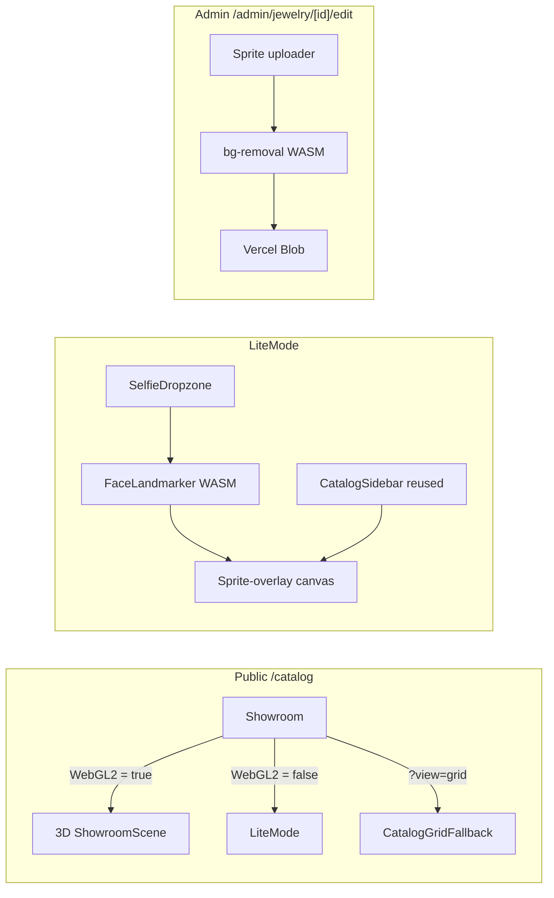

# 15 — Photo-upload Lite Mode

> Phase 2 work stream 1. The first non-Phase-1 feature shipping after the
> 15-task v1 roadmap.
>
> **Status legend:** ✅ done · 🟡 partial · ⏸ paused · ⬜ not started.
>
> ⚠️ **Outdated (audit-hardening branch):** the admin sprite-upload UI
> (`JewelrySpriteManager` / `JewelrySpriteUploader` / `SpriteAutoRemover`) and
> the `uploadJewelrySprite` / `removeJewelrySprite` server actions were removed.
> The `Jewelry.spriteUrl` column and the **read-side** sprite compositing in lite
> mode are unchanged — sprites are currently set via seed/DB until an uploader is
> re-introduced. Sections below that describe the admin uploader are historical.

A 2D fallback try-on for devices that fail the WebGL2 capability check.
Visitor uploads a selfie, MediaPipe Face Landmarker locates piercing
positions on the face, and chosen jewelry sprites overlay at anchor
points. Same multi-piece tray, same `?eq=` URL state, same
`Забронировать` hand-off as the 3D showroom — fully client-side, the
photo never leaves the browser.

## Problem statement

The 3D showroom at `/catalog` requires WebGL2. Devices that fail the
capability check (older Android phones, low-end browsers, WebGL-disabled
configurations) currently see [`CatalogGridFallback`](../components/catalog/CatalogGridFallback.tsx)
— a 2D card grid with no try-on. That regresses the core "see jewelry on
yourself before you book" experience for the audience least able to
afford a poor first impression.

Lite mode replaces that auto-fallback path: instead of a static grid,
the visitor gets an interactive 2D try-on built around their own selfie.
Multi-piece, draggable, exportable, bookable.

## Scope

### In v1

- **7 face anchors** — landmark-direct, no extrapolation needed:
  `left-nostril`, `right-nostril`, `septum`, `lip-medusa`, `lip-labret`,
  `left-eyebrow`, `right-eyebrow`.
- **Photo upload only** — no live camera. Drop or pick a still image,
  process once, sprites overlay on the still.
- **Multi-piece try-on** — full parity with the 3D showroom: soft cap of
  6 simultaneous pieces, shared `?eq=anchorSlug:jewelryId,...` URL
  contract, same `<CatalogSidebar>` UI, same `Забронировать` deep-link.
- **Drag-to-nudge** — every placed sprite can be dragged on the canvas
  to fine-tune position. Ephemeral (lost on reload). No pinch-zoom.
- **Save-to-image** — export the composed look as a PNG.
- **Photo swap mid-session** — replace the selfie without losing the
  equipped tray; sprites re-place themselves on the new face.
- **Auto sprite generation** — admin uploads a regular jewelry photo,
  `@imgly/background-removal` runs in the admin's browser, the
  transparent PNG becomes `Jewelry.spriteUrl`. Manual transparent-PNG
  upload remains as the override.

### Deferred to a future iteration

- **Ear anchors** — `left/right-ear-lobe`, `left/right-helix`,
  `left/right-tragus`, `left/right-conch`, `left/right-daith`,
  `left/right-rook`, `left/right-industrial`. MediaPipe Face Landmarker's
  478 mesh points end at the jaw line; ear anchors require extrapolating
  from temple/jaw landmarks with a sideways offset, which needs
  empirical tuning beyond v1's scope.
- **Tongue** — not visible in a normal selfie.
- **Body anchors** — `left/right-nipple`, `navel`, `left/right-hip`,
  `left/right-ankle`. Would require a second model (Pose Landmarker)
  whose accuracy on these specific landmarks is rough; deferred until
  there is concrete demand.
- **Live camera capture** — the lite path explicitly targets low-end
  devices; live tracking contradicts that goal. Photo upload is the v1
  capture mode.

## Requirements

### Functional

- **F1.** Visitors with WebGL2 unavailable land on lite mode automatically
  at `/catalog` (replaces `CatalogGridFallback` as the auto-fallback);
  explicit `?view=grid` still opts into the old grid.
- **F2.** Visitor uploads a selfie → MediaPipe detects landmarks → 7 v1
  face anchors are positioned. Anchors not in the v1 set are excluded
  from lite mode.
- **F3.** Visitor picks anchor + jewelry from a sidebar (the existing
  [`CatalogSidebar`](../components/catalog/CatalogSidebar.tsx)); sprite
  overlays at the anchor. Multi-piece up to `SOFT_CAP=6`, same
  `?eq=anchorSlug:jewelryId,...` URL contract as the 3D showroom.
- **F4.** Drag-to-nudge any placed sprite (ephemeral; lost on reload).
  No pinch-zoom.
- **F5.** Save the composed look as a PNG (`Сохранить картинку`).
- **F6.** Swap selfies mid-session (`Загрузить другое фото`) without
  losing equipped pieces.
- **F7.** `Забронировать` hands off to `/book?items=...` exactly like
  the showroom.
- **F8.** Storytelling Chapter 2 falls back (when WebGL2 unavailable) to
  a CTA + thumbnail strip linking to `/catalog?eq=...` — does **not**
  embed lite mode in-place.
- **F9.** Pieces without `spriteUrl` are filtered from try-on; banner
  shows `Доступно для примерки на фото: X из Y` with a `Все украшения`
  toggle that swaps the sidebar to the existing `CatalogGridFallback`
  grid.
- **F10.** Admin uploads a sprite per jewelry — primary path is
  in-browser auto bg-removal via `@imgly/background-removal`, manual
  transparent-PNG override available. Stored on new `Jewelry.spriteUrl`
  column.

### Non-functional

- **N1.** Russian-language UI throughout (`liteMode.*` and
  `admin.jewelry.sprite.*` in [`lib/i18n/ru.ts`](../lib/i18n/ru.ts)).
- **N2.** All processing client-side; selfie never leaves the browser.
- **N3.** Privacy disclosure visible: `Фото остаётся в вашем браузере и
  не загружается на сервер.`
- **N4.** WASM models self-hosted on Vercel Blob (`face_landmarker.task`
  ≈3.8 MB; imgly bundle ≈25 MB).
- **N5.** Mobile-first responsive at 360 px width.
- **N6.** Lazy-load all WASM (~30 MB total) only when WebGL2 unavailable
  AND user opens `/catalog`, or admin opens the sprite uploader. Other
  pages stay lean.
- **N7.** Schema additions are non-breaking — `Jewelry.spriteUrl` is
  nullable; Phase 1 flows unchanged.

## Architecture



The lite-mode path is a pure runtime branch off
[`Showroom.tsx`](../components/catalog/Showroom.tsx)'s existing WebGL2
check (`useWebGL2Supported() === false`). Today that branch returns
`<CatalogGridFallback>`; lite mode replaces it with `<LiteMode>` while
keeping the explicit `?view=grid` opt-in for users who prefer the old
grid.

`<LiteMode>` mirrors `Showroom.tsx`'s state shape: it owns
`selectedId` + `equipped`, syncs them to the URL via the same
`?anchor=` / `?eq=` contract, and renders the existing
`<CatalogSidebar>` with sprite-eligible jewelry filtered in. The canvas
viewport lives where the 3D `<Canvas>` would in the showroom layout.

The admin sprite upload flow runs entirely in the admin's browser:
`@imgly/background-removal` reads the original photo, produces a
transparent PNG `Blob`, and the existing `uploadJewelrySprite` server
action puts it on Vercel Blob. The model files for both MediaPipe and
imgly are self-hosted on our Blob (one-shot upload script) so neither
the visitor nor the admin depends on Google's or imgly's CDN at
runtime.

## Data model changes

One new nullable column on `Jewelry`:

```prisma
model Jewelry {
  // ... existing fields ...
  spriteUrl String?  // transparent PNG for 2D lite-mode try-on
  // ... existing fields ...
}
```

Migration: `npx prisma migrate dev --name add-jewelry-sprite-url`.

Sprite eligibility rule, applied when populating the lite-mode sidebar:
a published jewelry shows up in the try-on list **iff** `spriteUrl !== null`.
Pieces without a sprite stay visible in the `Все украшения` grid view (a
toggle in lite mode that exposes the existing `CatalogGridFallback`).

## Initial landmark mapping

[MediaPipe Face Landmarker](https://ai.google.dev/edge/mediapipe/solutions/vision/face_landmarker)
emits 478 indexed face-mesh points per detected face. The 7 v1 anchors
have direct landmarks; no extrapolation needed.

| Anchor slug      | Landmark idx | Sprite width (% face bbox) |
|------------------|-------------:|---------------------------:|
| `left-nostril`   |           49 |                         4% |
| `right-nostril`  |          279 |                         4% |
| `septum`         |            2 |                         5% |
| `lip-medusa`     |            0 |                         6% |
| `lip-labret`     |           17 |                         6% |
| `left-eyebrow`   |          105 |                         6% |
| `right-eyebrow`  |          334 |                         6% |

Lives in [`lib/lite/anchor-config.ts`](../lib/lite/anchor-config.ts) as
the single source of truth (created in Task 4). Initial values come
from MediaPipe's documented topology; tune empirically with 3–5 real
test selfies before merging Task 4.

Sprite display size = `widthPct × faceBboxWidth`, where
`faceBboxWidth` is the bounding box of all detected landmarks. This
keeps sprites proportional whether the user uploads a close-up portrait
or a half-body shot.

## WASM hosting

Both runtime models live on **Vercel Blob** under `lite/`:

- `lite/mediapipe/face_landmarker.task` — MediaPipe Face Landmarker
  model, ≈3.8 MB. Pulled by every visitor when they open lite mode.
- `lite/imgly/<filename>` — imgly bg-removal model bundle, ≈25 MB.
  Pulled by the admin when they open the sprite uploader.

A one-shot Node script
[`scripts/lite/upload-wasm-assets.mjs`](../scripts/lite/upload-wasm-assets.mjs)
mirrors the upstream files into Blob:

- Reads `BLOB_READ_WRITE_TOKEN` from `.env` (same env var Phase 1 uses).
- Hashes each local file; skips upload if the existing Blob has the
  same hash. Idempotent — safe to re-run.
- Logs each file uploaded vs skipped.

Run `npm run lite:wasm` once after the first deploy and again only if
the imgly version is bumped.

[`lib/lite/wasm-urls.ts`](../lib/lite/wasm-urls.ts) exports
`FACE_LANDMARKER_MODEL_URL` and `IMGLY_PUBLIC_PATH` constants pointing
to the Blob URLs; the runtime code never references upstream CDNs.

For the small MediaPipe Vision WASM bootstrapper (the `.wasm` files
that load the `.task` model — a few hundred KB total), we use Google's
public CDN via `FilesetResolver.forVisionTasks(...)`. Only the heavy
`.task` model is self-hosted; the bootstrapper files are tiny and don't
warrant the mirror.

## Sprite admin flow

`<JewelrySpriteManager>` lives on `/admin/jewelry/[id]/edit` next to
the existing photo + GLB managers. A segmented control switches between
two paths:

### Авто (default)

`<SpriteAutoRemover>`:
1. Admin drops a regular jewelry photo (any image MIME).
2. The widget dynamically imports `@imgly/background-removal` (first
   call only — model + WASM cached afterward).
3. `removeBackground(file)` returns a transparent-background `Blob`.
4. The transparent result is rendered over a CSS-checkered tile so the
   admin can verify the cutout quality.
5. `Сохранить` commits via the `uploadJewelrySprite` server action.
6. `Загрузить вручную` switches to the manual path.

### Вручную

The original Task 2 path: file input accepting only `image/png`, the
admin uploads an already-transparent PNG made elsewhere (Photoshop,
remove.bg, whatever). Same `uploadJewelrySprite` action handles it.

Both paths end on `Jewelry.spriteUrl`. Replacing always deletes the
previous Blob to avoid orphans (mirroring `uploadJewelryGlb`'s pattern).

## Privacy notes

- **Selfie processing is 100% client-side.** The user's photo is held
  as a `Blob` URL in the page's memory and never POSTed to the server.
- **Disclosure copy** (visible under the dropzone and in a tooltip next
  to `Сохранить картинку`):

  > Фото остаётся в вашем браузере и не загружается на сервер.

- **No telemetry on the selfie or detected landmarks.** Only the
  jewelry-id list (which the URL already carries) hits the server when
  the user clicks `Забронировать`.
- **Save-to-image** writes the composite to the user's local downloads
  folder via a same-origin `<a download>`; no upload step.

## Task list

Implementation roadmap. Each task is incremental, ends with a working
demoable increment, and builds on the previous tasks. No orphaned code.

### Task 1: Documentation ✅

This file. Plus the back-reference in
[`13-phase-2.md`](./13-phase-2.md). No application code changes.

### Task 2: Schema field + admin manual sprite upload ✅

Add `Jewelry.spriteUrl String?` and run the migration. Add
`uploadJewelrySprite` + `removeJewelrySprite` server actions in
[`lib/admin/jewelry-actions.ts`](../lib/admin/jewelry-actions.ts)
(mirroring `uploadJewelryGlb`'s pattern: Blob `put` to
`jewelry/<id>/sprite/<timestamp>-<safeName>`, accepts only `image/png`,
4 MB cap, deletes previous sprite Blob on replace, `revalidatePath` per
the existing `revalidateForJewelry`).

Add `<JewelrySpriteManager>` client component (mirroring
[`<JewelryModelManager>`](../components/admin/JewelryModelManager.tsx))
with a file input, current-sprite preview rendered over a CSS checker
tile, and `Удалить спрайт` form button. Wire into the edit page in a
new `Спрайт для примерки на фото` panel between the photos panel and
the GLB panel.

Add `admin.jewelry.sprite.{title, uploadHint, replaceHint, removeButton, manualOnlyHint, sizeLimit, typeError, sizeError}`
strings to `lib/i18n/ru.ts`.

**Demo:** admin uploads a hand-cut transparent PNG to a jewelry, sees
it persist over a checker tile, replaces it, deletes it. Phase 1
photo + GLB flows untouched.

**Implementation notes:**
- Schema field added to `prisma/schema.prisma`. The plan called for
  `npx prisma migrate dev`; the project uses `prisma db push`
  (`npm run db:push`) instead — there is no `prisma/migrations/`
  folder. Run `npm run db:push` against dev and prod to apply.
- Server actions: `uploadJewelrySprite` + `removeJewelrySprite` added
  to [`lib/admin/jewelry-actions.ts`](../lib/admin/jewelry-actions.ts),
  mirroring the GLB upload pattern.
- Components: `JewelrySpriteUploadForm.tsx` (manual file input) and
  `JewelrySpriteManager.tsx` (orchestrating panel) both live in
  [`components/admin/`](../components/admin/).
- The preview uses a plain `` tag (not `next/image`) so the
  transparent PNG isn't reprocessed and alpha stays intact. Lint warning
  is acknowledged with an eslint-disable comment on that line.
- Wired into
  [`app/admin/(protected)/jewelry/[id]/edit/page.tsx`](../app/admin/(protected)/jewelry/[id]/edit/page.tsx)
  between the photos panel and the 3D model panel, matching the spec.
- i18n strings live under `ru.admin.jewelry.sprite.*`.

### Task 3: In-browser auto bg-removal + manual override ✅

Install `@imgly/background-removal` as a direct dep. Add
`scripts/lite/upload-wasm-assets.mjs` (idempotent imgly mirror) and
`npm run lite:wasm`. Add `lib/lite/wasm-urls.ts` (`IMGLY_PUBLIC_PATH`
constant) and `lib/lite/bg-removal.ts` (lazy initializer with
`publicPath` pointed at our Blob).

Add `<SpriteAutoRemover>` client component — file input → progress
state → transparent preview → `Сохранить` (calls
`uploadJewelrySprite`) / `Загрузить вручную` (switches to Task 2
flow). Update `<JewelrySpriteManager>` with an `Авто` / `Вручную`
segmented control; `Авто` is the default.

Update `README.md` deployment checklist with the `npm run lite:wasm`
step.

**Demo:** admin clicks `Авто`, drops a studio shot, watches bg removal
in browser in ~3 seconds, commits the transparent result. Falls back
to `Вручную` for ugly cutouts.

**Implementation notes:**
- `@imgly/background-removal@^1.7` installed (newer than the spec's
  pinned ^1.6 — package settled on 1.7 as latest stable). The library
  surface is unchanged.
- `lib/lite/wasm-urls.ts` exports `BLOB_PUBLIC_ORIGIN`,
  `IMGLY_PUBLIC_PATH`, and `FACE_LANDMARKER_MODEL_URL` constants.
  `BLOB_PUBLIC_ORIGIN` is hardcoded for this project's Blob deployment;
  if the project ever moves to a different Blob, update that one constant.
- `lib/lite/bg-removal.ts`: `removeBackground(file, { onProgress })`
  wraps the imgly entry point with our self-hosted `publicPath`. Note:
  the imgly README documents a default import, but the actual ESM
  module exposes only named exports; `bg-removal.ts` uses the named
  `removeBackground` accordingly.
- `scripts/lite/upload-wasm-assets.mjs`: ~270 lines, fully idempotent.
  Mirrors imgly's content-addressed chunks (each named after its
  SHA-256) plus the `resources.json` manifest. Tags every Blob with
  the source hash via `contentDisposition`, then uses `head()` to
  compare on subsequent runs. Also mirrors MediaPipe's
  `face_landmarker.task` (used by Task 4).
- `<SpriteAutoRemover>` client component drives the auto pipeline:
  file picker → dynamic-import bg-removal → in-memory progress →
  transparent preview → Save (calls `uploadJewelrySprite` directly
  with a synthesized `File`). Plain styled `<button>` instead of
  `PrimarySubmit` because the save isn't a form submit.
- `<JewelrySpriteUploader>` is the new client wrapper with the
  Авто / Вручную segmented control; tab state is in-memory only.
  `<JewelrySpriteManager>` (server component) still owns the preview
  + remove flow above, then embeds the uploader.
- npm script `lite:wasm` added to package.json. README's "Available
  scripts" table updated. Deployment checklist (Task 9) will surface
  this for prod ops.
- Plan called for ~25 MB of imgly assets; the actual mirror is closer
  to ~80 MB across many chunks (the manifest exposes an ort-wasm
  variant per backend, plus the ISNet model's chunk pieces). Still
  comfortably within Vercel Blob Hobby's 1 GB allowance.

### Task 4: Lite mode shell — selfie + landmarks + debug dots ✅

Hoist `@mediapipe/tasks-vision` to a direct dep. Extend
`scripts/lite/upload-wasm-assets.mjs` to mirror `face_landmarker.task`
to `lite/mediapipe/`. Add `FACE_LANDMARKER_MODEL_URL` to
`lib/lite/wasm-urls.ts`.

Create `lib/lite/{types, anchor-config, face-landmarker, canvas-render}.ts`:
- `types.ts` — `LandmarkPoint`, `AnchorPlacement`, etc.
- `anchor-config.ts` — the 7 v1 anchors with landmark idx + sprite
  width %. Anchors not in this table are excluded from lite mode.
- `face-landmarker.ts` — lazy `FaceLandmarker.createFromOptions` with
  `runningMode: "IMAGE"`, `numFaces: 1`, `modelAssetPath` pointing to
  our Blob.
- `canvas-render.ts` — `drawDebugDots()` (Task 4 only) + stubbed
  `composite()` (Task 5 fills it in).

Create `<SelfieDropzone>` (drag-drop + click-to-pick) and
`<SelfieCanvas>` (loads photo, runs Face Landmarker, draws debug dots
at the 7 anchor positions). Compose them in `<LiteMode>` (top-level
container).

Replace the `webgl2Supported === false` branch in
[`Showroom.tsx`](../components/catalog/Showroom.tsx) with `<LiteMode>`.
Keep the `?view=grid` page-level path. Extend `JewelryWire` with
`spriteUrl: string | null` and update the
[catalog page wire](../app/(public)/catalog/page.tsx) mapping.

Add `liteMode.{dropzone.*, processing, errors.*}` strings.

**Demo:** WebGL2 disabled, navigate to `/catalog`, see selfie
dropzone, upload a face photo, see 7 colored dots on nostrils +
septum + both lips + both eyebrows.

**Implementation notes:**
- Hoisted `@mediapipe/tasks-vision@0.10.17` (pinned to the version
  drei already pulls in, for compatibility).
- The `composite()` stub mentioned in the spec was dropped — Task 5
  will reintroduce it. ESLint flagged the unused params; cleaner to
  ship the function in the task that uses it.
- MediaPipe ships its WASM bootstrapper inside the npm package
  (~9 MB each). Loading the bootstrapper from `node_modules` would
  require copying to `public/` at build time. To keep build-time
  changes minimal, `face-landmarker.ts` points
  `FilesetResolver.forVisionTasks()` at jsDelivr's pinned-version CDN
  (`https://cdn.jsdelivr.net/npm/@mediapipe/tasks-vision@0.10.17/wasm`).
  The `.task` model itself is still self-hosted on Blob.
- `<LiteMode>` keeps the Task 5/6/7 props in its API but `void`-casts
  them to satisfy ESLint until the sidebar lands. Task 5 strips the
  void-cast as it consumes them.
- Object-URL lifecycle uses `useMemo` for creation + a separate
  `useEffect` for revocation — avoids the project's
  `react-hooks/set-state-in-effect` lint error.
- `<Showroom>` no longer imports `<CatalogGridFallback>` — that path
  is now reached only via the explicit `?view=grid` query string,
  handled at the page level (`app/(public)/catalog/page.tsx`).

### Task 5: Sprite overlay + multi-piece equip/unequip ✅

Implement real `composite(canvas, photo, placements, equipped, jewelryById, dragOffsets)` —
draws photo + each equipped sprite at `placements[anchor].pixel` scaled
by `widthPct × faceBboxWidth` plus optional `dragOffsets`. Sprite
images are loaded as `HTMLImageElement` with a Map cache; redraw on
each new sprite load.

Wire `<SelfieCanvas>` to call `composite()` on mount, photo change,
and equipped change. Pre-load sprite images on first reference.

Render `<CatalogSidebar>` next to the canvas in `<LiteMode>` using the
same `pathname` / URL-sync pattern as `Showroom.tsx`. Filter `jewelry`
to `spriteUrl != null` before passing to the sidebar. SOFT_CAP=6 +
`Забронировать` link work via `CatalogSidebar`'s existing props.

If the URL-sync logic is verbose enough across `Showroom` + `LiteMode`,
extract into a `lib/catalog/use-equipped-state.ts` hook. Otherwise
duplicate carefully.

**Demo:** WebGL off, `/catalog` → upload selfie → pick septum from
sidebar → click `Примерить` on a sprite-eligible piece → sprite
overlays. Add an eyebrow piece. Add another. Click `Забронировать` →
lands on `/book?items=...`.

**Implementation notes:**
- `composite()` shipped in `lib/lite/canvas-render.ts` — draws photo
  background, then iterates `equippedBySlug`, looks up placement +
  sprite from caller-managed caches, draws each sprite centered on
  `pixel + dragOffsets[<key>]` at `widthPct × faceBboxWidth`. Anchors
  not in `LITE_ANCHORS_BY_SLUG` (i.e. ear/body/tongue) fall back to
  4% bbox width so future task widening doesn't crash.
- `<SelfieCanvas>` now owns: photo `` ref, placements state,
  sprite Image cache (`Map<jewelryId, HTMLImageElement>`), and a
  `spriteVersion` counter that bumps on each sprite-load to trigger
  redraw. The whole pipeline is one async chain (decode → detect →
  render) plus a separate sprite-preload effect.
- `<LiteMode>` now mirrors `Showroom.tsx`'s state shape and URL-sync
  logic. The duplication is intentional (per the spec's optional
  `lib/catalog/use-equipped-state.ts` extraction note); both surfaces
  are stable enough that an extracted hook would have to take a lot
  of parameters to be useful, so leaving it duplicated for now is
  cleaner. Extract later if a third surface ever needs it.
- Layout matches Showroom: `flex h-full flex-col lg:grid lg:grid-cols-[1fr_360px]`,
  canvas left, `<CatalogSidebar>` right (stacks vertically on mobile).
- `liteJewelry = jewelry.filter(j => j.spriteUrl != null)` is the
  array passed to the sidebar — Task 7's banner + "Все украшения"
  toggle expose the unfiltered list for browsing.
- `<SelfieCanvas>` accepts an optional `debugDots: boolean` prop that
  routes to `drawDebugDots` instead of `composite` — useful when
  re-tuning landmark indices for new anchors. Off by default.

### Task 6: Drag-to-nudge gesture (ephemeral) ✅

Pointer-event handling in `<SelfieCanvas>`: `pointerdown` over a
sprite captures it as the active drag target (top-most-wins
hit-testing); `pointermove` updates `dragOffsets[${anchorSlug}:${jewelryId}]`;
`composite()` adds offsets when drawing.

Per-sprite `↺` reset badge clears that sprite's offset. Ephemeral —
`dragOffsets` lives in `useState`, never URL or storage. Reset on
photo swap.

Use `touchAction: "none"` on the canvas to prevent scroll-jacking on
mobile.

**Demo:** place 3 pieces → drag the eyebrow sprite slightly →
refresh → eyebrow returns to auto-position (intended). Place again →
drag → reset → snap back without refresh.

**Implementation notes:**
- `dragOffsets` lives in `<LiteMode>` (lifted from `<SelfieCanvas>`)
  so it survives canvas remounts and can be cleared cleanly when the
  photo swaps. `<SelfieCanvas>` accepts `dragOffsets` + an
  `onUpdateOffset(key, point)` callback.
- Pointer-to-image conversion accounts for `object-contain`
  letterboxing — `pointerToImage()` in `<SelfieCanvas>` resolves
  pointer events to the canvas's natural-pixel coordinate system.
- Hit-test iterates placements in reverse so visually-on-top sprites
  win when their bboxes overlap (e.g., eyebrow next to nostril).
- Reset UX deviates from the spec: per-sprite ↺ badges were dropped
  because they require reading canvas refs during render to position
  themselves (which trips the project's `react-hooks/refs` rule).
  Replaced with a single "Сбросить смещения" overlay button on the
  canvas (top-left) that clears all offsets at once. Same intent,
  smaller blast radius. Per-sprite reset can be revisited later via
  a ResizeObserver-driven canvas-rect state if needed.
- The sprite cache moved from `useRef<Map>` to `useState<Map>` so
  reads from `composite()` and `hitTest` happen against state, not a
  ref — also resolves the `react-hooks/refs` rule for these reads.
- `touchAction: "none"` on the canvas prevents iOS Safari scroll-
  jacking during drag.

### Task 7: Unsprited-piece bridge + save-to-image PNG ✅

Add `<LiteBanner>` showing `Доступно для примерки на фото: X из Y`
with a `Все украшения` button. When that toggle is active, swap the
right pane from `<CatalogSidebar>` to
`<CatalogGridFallback jewelry={jewelry} reason="explicit" />`. Selfie
canvas stays on the left/top. `Вернуться к примерке` switches back.

Add `Сохранить картинку` button on `<SelfieCanvas>` —
`canvas.toBlob('image/png')` triggers download as
`pierc-tryon-<YYYYMMDD-HHmmss>.png` at original photo resolution.
Helper `saveToImage(canvas, filename)` in `canvas-render.ts`.

Add `liteMode.{banner.*, save.*}` strings.

**Demo:** lite mode with 3 of 21 sprites uploaded → banner shows
`3 из 21` → click `Все украшения` → see full grid → `Вернуться к
примерке` → back to try-on. Click `Сохранить картинку` → PNG
downloads.

**Implementation notes:**
- `<LiteBanner>` lives at the top of `<LiteMode>` above the canvas+
  sidebar grid. The eligibility count and intro copy switch based on
  the active view (`tryon` vs `grid`).
- `view: 'tryon' | 'grid'` state lives in `<LiteMode>` (not URL — the
  toggle is ephemeral). Right pane switches between
  `<CatalogSidebar jewelry={liteJewelry}>` and
  `<CatalogGridFallback jewelry={jewelry}>` accordingly. The grid
  view shows the full catalog; the try-on sidebar still filters to
  sprite-eligible pieces.
- `saveToImage(canvas, filename)` in `lib/lite/canvas-render.ts` uses
  `canvas.toBlob('image/png')` + an ephemeral `<a download>` to
  trigger the download. Blob URL is revoked after a 1-second delay
  to give the browser time to claim it.
- `buildTryOnFilename(now)` produces `pierc-tryon-YYYYMMDD-HHmmss.png`
  using local time.
- Save button overlays the bottom-right of the canvas, only visible
  when `stage.kind === 'ready'` so we never offer to download a
  half-rendered scene.

### Task 8: Storytelling Chapter 2 fallback CTA ✅

In [`StoryChapter2.tsx`](../components/landing/StoryChapter2.tsx), add
`useWebGL2Supported()` and branch on `false`:

- Title (small heading, RU)
- Body: `Чтобы примерить украшения на своём фото, откройте каталог.`
- Thumbnail strip showing the user's Chapter 1 picks (parsed from
  `?eq=...`).
- Primary CTA `Примерить на своём фото в каталоге →` linking to
  `/catalog?eq=<current eq value>`.
- Secondary CTA `Сразу к записи` linking to
  `/book?items=<jewelryIds extracted from eq>`.

High-WebGL behavior unchanged — wrap the existing chapter body in a
`webgl2Supported === false ? <Fallback /> : <ExistingChapter />`.

Add `liteMode.chapter2Fallback.{title, body, primaryCta, secondaryCta}`
strings.

**Demo:** WebGL off, `/`, walk Hero → Chapter 1 (pick 2 pieces) →
Chapter 2 → see fallback with thumbnails of the 2 picks → primary CTA →
`/catalog` opens in lite mode → upload selfie → 2 picks already
equipped.

**Implementation notes:**
- `<StoryChapter2>` converted to a client component to use the
  `useWebGL2Supported()` hook. The capability check returns `null` on
  initial mount; we keep the showroom embed during that window so
  high-WebGL devices don't see a fallback flash, then swap to the
  fallback only when the hook explicitly resolves `false`.
- Fallback panel sits inside the chapter container instead of replacing
  it, preserving the chapter's vertical rhythm and the existing
  Hero/Chapter 1 → Chapter 3 flow.
- Thumbnail strip shows up to 6 picks from `initialEquipped` resolved
  against the `jewelry` array; uses `next/image` for the small
  thumbnails since they're likely the same Blob URLs as the catalog
  cards.
- The CTA URLs are computed via `serializeEquipped()` (same helper
  Showroom + LiteMode use), so picks carry across cleanly. Empty
  `equipped` falls back to bare `/catalog` and `/book` (no
  `?eq` / `?items=` params).

### Task 9: Privacy disclosure, mobile polish, photo swap, deployment docs ✅

Privacy `ⓘ` icon next to `Сохранить картинку` with the disclosure
tooltip. Persistent one-line privacy hint under the dropzone.

`Загрузить другое фото` button — clears photo + `dragOffsets`, keeps
`equipped`. Sprites re-place themselves on the new face once the
landmarker resolves.

Mobile pass at 360 px width: lite mode stacks vertically, canvas top
(~60 vh), sidebar/grid below. Sprite drag-nudge still works on small
canvases.

Final i18n consolidation. README.md deployment-checklist update with
the `npm run lite:wasm` step and `BLOB_READ_WRITE_TOKEN` requirement.

**Demo:** live URL on Android with WebGL2 disabled → full flow
including selfie swap and PNG export → `Забронировать` → `/book`
completes the booking.

**Implementation notes:**
- Privacy disclosure now appears as a one-liner under the dropzone
  (visible to first-time users before they upload). The same string
  is referenced from the save-image button's `title` tooltip via the
  shared `liteMode.save.hint` key — i.e., privacy intent is signaled
  twice without duplicating copy.
- "Загрузить другое фото" button is a styled `<label>` wrapping a
  hidden `<input type="file">` placed in the canvas's top-right
  corner. Clicking it opens the file picker; selecting a new file
  calls `handleFile` which sets `photoFile` and clears `dragOffsets`
  via the same path as the initial upload. `equipped` is preserved,
  so sprites re-place themselves on the new face automatically.
- Mobile layout already inherits the showroom's stack-on-mobile
  pattern (`flex h-full flex-col lg:grid lg:grid-cols-[1fr_360px]`);
  no additional breakpoints needed for 360 px width — `<CatalogSidebar>`
  is already mobile-friendly.
- README's "5. Smoke checklist" extended with the lite-mode browser
  test and the admin sprite uploader. New "6. Lite mode (photo-upload
  try-on) — one-time setup" section walks through `db:push` for the
  `Jewelry.spriteUrl` column, `npm run lite:wasm` to mirror the
  WASM assets, and the admin sprite-upload step.
- All visible RU strings now live in `lib/i18n/ru.ts` under
  `catalogStrings.liteMode.*` and `ru.admin.jewelry.sprite.*`.

## Risks & open questions

- **MediaPipe init time on low-end Android (~1–2 s for first
  `FaceLandmarker.createFromOptions`).** Acceptable — the user just
  uploaded a photo and expects processing. Show `Анализирую фото…`
  state.
- **`@imgly/background-removal` cold-start (~25 MB download, ~5 s init
  on mid-range admin machines).** Affects admin only; cached after
  first run.
- **Landmark accuracy on heavily-tilted faces.** Drag-to-nudge is the
  safety net. If testing reveals unacceptable drift, add a `Поверните
  голову прямо` hint in Task 4.
- **Sprite quality dependency on admin upload hygiene.** Auto bg-removal
  handles the "clean studio shots" case well per the user's preference;
  manual override is one click away.
- **Storytelling Chapter 1 thumbnail strip data flow.** Chapter 2 has
  access to the current `?eq=` from URL; thumbnails resolve via the
  existing `JewelryWire` array flowing through the chapter. No new
  data wiring needed.
- **Body anchors deferred.** Track as Phase 2.5 work in
  [`13-phase-2.md`](./13-phase-2.md) if/when demand surfaces.
- **Ear anchors deferred.** Same as above; would land as a follow-up
  task once the temple/jaw extrapolation math is empirically tuned.
