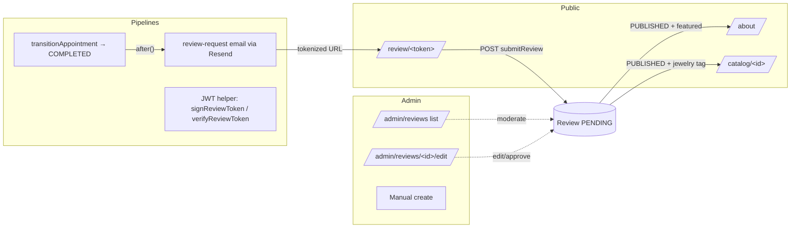

# 16 — Reviews & Testimonials

> Phase 2 work stream 2. Ships after the photo-upload lite mode
> (see [`15-lite-mode.md`](./15-lite-mode.md)).
>
> **Status legend:** ✅ done · 🟡 partial · ⏸ paused · ⬜ not started.

Customer reviews on the public site — admin-curated and auto-collected
via post-appointment magic-link emails. Surfaces social proof on
`/about` (featured testimonials) and per-piece on `/catalog/[id]` so
visitors browsing a specific labret see what real customers thought of
that exact piece.

## Problem statement

The studio has lived feedback scattered across Instagram comments,
Telegram DMs, and in-person notes — but none of it shows up on the
site. Visitors land on `/catalog/[id]` and see materials, dimensions,
and a price, but no signal that real customers liked the piece. That's
a gap exactly when conversion intent is highest.

This stream adds a `Review` model with a moderation pipeline, two
public surfaces (`/about` for general testimonials, `/catalog/[id]`
for per-piece reviews), and an automated post-appointment email that
asks satisfied customers to leave a review with a single tokenized
link — no signup required.

## Scope

### In v1

- **Two submission paths**:
  - **Admin manual entry** — admin pastes reviews from existing
    Instagram/Telegram channels via `/admin/reviews`. Available on
    day one so the site has social proof immediately.
  - **Magic-link email** — when an `Appointment` transitions to
    `COMPLETED`, the system sends an email with a tokenized URL.
    Customer clicks, fills the form, the review lands as `PENDING`
    for moderation. No signup required.
- **Optional verification link** — `Review.appointmentId` is nullable.
  Magic-link reviews carry the link → "Проверенный клиент" badge.
  Admin manual entries don't, but otherwise render the same.
- **Optional jewelry tagging** — many-to-many relation between
  `Review` and `Jewelry`. A piercing session often produces 1–3
  pieces; magic-link forms pre-populate from the appointment's
  `JewelryBooking` rows. Reviews tagged to a jewelry appear on its
  catalog detail page.
- **Optional photo** — customer can attach a single photo (e.g.,
  showing the new piercing). Stored on Vercel Blob, public URL.
- **Three-state moderation** — `PENDING` (default for new
  submissions) / `PUBLISHED` / `REJECTED`. Only `PUBLISHED` reviews
  show up publicly. Admin can flip status at any time.
- **Featured flag** — admin marks ≤6 reviews `featured` to surface
  them on `/about`'s testimonials section.
- **5-star rating** — required, default 5.
- **Display**:
  - `/about` — "Что говорят клиенты" section, top featured reviews.
  - `/catalog/[id]` — bottom of detail page, most recent N reviews
    tagged to that piece.

### Deferred to a future iteration

- **Dedicated `/reviews` index page** — wait until published volume
  exceeds ~50 reviews. Meanwhile the two existing surfaces cover the
  high-conversion paths.
- **Review replies / piercer responses** — admin can edit review text
  inline if a typo or sensitive detail needs cleanup; full reply
  threading is overkill for the current scale.
- **Helpfulness votes / sorting by usefulness** — same scale argument.
- **Aggregate rating average** on jewelry pages (e.g., "4.8 из 5") —
  meaningful only with ≥3 reviews per piece; small catalog means most
  pieces will have 0–2 reviews for a long time.
- **Multi-piercer attribution** — moot until multi-piercer lands as a
  separate work stream.
- **Captcha on the magic-link form** — token already proves the user
  had a real appointment; bots can't generate valid tokens. If spam
  ever materializes, swap in a captcha then.

## Requirements

### Functional

- **F1.** Admin can create / edit / approve / reject / delete reviews
  via `/admin/reviews`. Filter list by status. Edit form covers
  rating, text, author name, photo, jewelry tags, featured toggle,
  status, moderator notes.
- **F2.** Reviews can optionally link to one `Appointment` (verified
  customer) and to many `Jewelry` rows (per-piece tags).
- **F3.** Public `/about` shows the top 6 `PUBLISHED` + `featured`
  reviews under a "Что говорят клиенты" heading, ordered by
  `publishedAt DESC`.
- **F4.** Public `/catalog/[id]` shows up to 5 `PUBLISHED` reviews
  tagged to that piece, ordered by `publishedAt DESC`. Section is
  hidden entirely when no reviews exist.
- **F5.** When admin transitions an `Appointment` to `COMPLETED` (with
  the existing "Уведомить клиента" checkbox enabled), a
  "Оставьте отзыв" email goes out alongside the existing
  status-change notification.
- **F6.** The email contains a tokenized link to `/review/[token]`.
  Token is JWT-signed with `AUTH_SECRET`, encodes `{ appointmentId,
  exp }`, valid for 60 days.
- **F7.** Public `/review/[token]` page validates the token, shows a
  pre-filled form (rating slider, text, author name from the user's
  account, jewelry tags pre-selected from the appointment's
  bookings), accepts an optional photo, submits via a server action
  that creates `Review(status=PENDING, appointmentId=…)`.
- **F8.** Reviews carrying an `appointmentId` render with a
  "Проверенный клиент" badge on every public surface.
- **F9.** Admin can re-trigger the review-request email manually from
  `/admin/appointments/[id]` (useful for old appointments before this
  feature shipped).

### Non-functional

- **N1.** RU UI throughout (`reviewsStrings.*` and
  `ru.admin.reviews.*` in [`lib/i18n/ru.ts`](../lib/i18n/ru.ts)).
- **N2.** Moderation is server-side only — no `PENDING` review ever
  renders on a public page.
- **N3.** Schema additions are non-breaking — `Review` is a new model;
  the m2m relation to `Jewelry` doesn't alter existing rows.
- **N4.** Token validation runs on every request to `/review/[token]`
  — expired or tampered tokens render an error page instead of the
  form.
- **N5.** Photo uploads from the customer-side form are size-capped
  (4 MB), MIME-validated (`image/*`), and rate-limited by the
  one-time-use token — once a review is submitted, the token is
  consumed (`Appointment.reviewedAt` set), and the form refuses
  re-submissions.
- **N6.** No PII (real full name, contact info) is rendered publicly;
  the form's "name" field is presented as "Как вас представить?" with
  guidance to use a first name + last initial.

## Architecture



The moderation flow mirrors the existing `Jewelry` review-status
pattern (`PENDING_REVIEW` → admin decides → `PUBLISHED` /
`REJECTED`), so the admin only learns one mental model.

## Data model changes

```prisma
enum ReviewStatus {
  PENDING
  PUBLISHED
  REJECTED
}

model Review {
  id             String       @id @default(cuid())
  rating         Int          @default(5)            // 1..5
  text           String
  authorName     String                              // "Анна П."
  photoUrl       String?                             // optional Vercel Blob URL
  status         ReviewStatus @default(PENDING)
  featured       Boolean      @default(false)        // surfaces on /about
  moderatorNotes String?

  appointment    Appointment? @relation(fields: [appointmentId], references: [id], onDelete: SetNull)
  appointmentId  String?

  jewelryItems   Jewelry[]    @relation("JewelryReviews")

  createdAt      DateTime  @default(now())
  updatedAt      DateTime  @updatedAt
  publishedAt    DateTime?

  @@index([status])
  @@index([featured])
  @@index([appointmentId])
}

model Appointment {
  // ... existing fields ...
  reviewedAt DateTime?  // set when a magic-link review submission succeeds
  reviews    Review[]
}

model Jewelry {
  // ... existing fields ...
  reviews Review[] @relation("JewelryReviews")
}
```

Migration: `npm run db:push` (project convention — see
[`docs/15-lite-mode.md`](./15-lite-mode.md) Task 2 implementation
notes). Fully additive + nullable, non-breaking.

## Surfaces

### `/admin/reviews`

- **List view** — table of all reviews, filter by status, columns:
  rating ★, author, jewelry tag count, status badge, created date.
  Row click → edit page.
- **Create / edit form** — `<ReviewForm>` with rating (1–5 select),
  text (textarea), authorName (input), photo upload (Vercel Blob),
  jewelry multi-select (chips), `appointmentId` read-only display
  with link to the appointment detail (when present), status select,
  featured toggle, moderator notes textarea.
- **Approve** is a status flip from `PENDING` to `PUBLISHED` plus a
  `publishedAt = now()` write, gated by the existing `assertAdmin()`
  guard. Reject sets `REJECTED`. Both surface as form actions on the
  edit page.

### `/about` — testimonials section

Renders below the existing About body and above the `#contact`
section. Server-side fetch: `Review[]` where
`status=PUBLISHED AND featured=true`, order by `publishedAt DESC`,
take 6. Rendered as a 2- or 3-column card grid (1 column on mobile)
with rating stars, author name + verified badge, text, optional
photo thumbnail. Hidden entirely when no featured reviews exist.

### `/catalog/[id]` — per-jewelry reviews

Below the existing description / attributes section. Server-side
fetch: `Review[]` joining `JewelryReviews` where the review's
`status=PUBLISHED` and the join row matches the current jewelry id,
order by `publishedAt DESC`, take 5. Same card style as `/about`.
Hidden when no reviews exist.

### `/review/[token]` — public submission form

Server component:
1. Verify the token (jose `jwtVerify` with `AUTH_SECRET`); on failure
   render an error page.
2. Look up the `Appointment` by the token's `appointmentId` and
   include user + jewelry bookings.
3. Refuse submission if `appointment.reviewedAt` is already set
   ("Отзыв уже оставлен").
4. Render `<ReviewForm>` pre-populated with the user's name and the
   appointment's jewelry pieces auto-selected.
5. Form action `submitReviewFromMagicLink(formData)` re-validates the
   token, creates `Review(status=PENDING)`, sets
   `Appointment.reviewedAt = now()`, redirects to a thank-you page.

Token shape (jose JWT):
```json
{
  "iss": "pierc/reviews",
  "sub": "<appointmentId>",
  "iat": <unix>,
  "exp": <unix + 60d>
}
```

## Magic-link email flow

`lib/admin/appointment-actions.ts::transitionAppointment`'s existing
`after()` hook already calls `sendStatusChangeNotification`. We
extend it: when the new status is `COMPLETED` AND the customer's
email is on file AND `appointment.reviewedAt` is null AND `notify` is
checked, also call `sendReviewRequestEmail(appointment, token)`.

Manual re-trigger: a small "Отправить запрос на отзыв" button on
`/admin/appointments/[id]` for COMPLETED appointments where
`reviewedAt` is null. Same template, same token freshness rules.

Email template lives in `lib/notifications/templates.ts` next to the
existing `userStatusChangeEmail` template. Both HTML and plain-text
variants. Subject: "Поделитесь впечатлением о визите".

## Privacy & moderation

- **No PENDING review ever leaks publicly.** All public queries
  filter by `status=PUBLISHED`.
- **Author name is presented, not the user's email.** The form
  prompts "Как вас представить?" with guidance toward a first name +
  last initial. Admin can edit the name during moderation if a
  customer accidentally submitted a full name.
- **Photos are optional.** When provided, they go to Blob under
  `reviews/<reviewId>/<timestamp>.<ext>`. Admin can remove them at
  moderation time.
- **Tokens are one-shot.** Once a review is submitted, the
  appointment's `reviewedAt` is set and the form refuses follow-up
  submissions on the same token. Re-triggering an email with a new
  token is the admin's choice.
- **Token expiry is 60 days.** Long enough to accommodate "I'll get
  to it later" customers; short enough to avoid stale tokens lying
  around indefinitely.

## Task list

Implementation roadmap. Each task is incremental and ends with a
working demoable increment.

### Task 1: Documentation ✅

This file. Plus the back-reference in
[`13-phase-2.md`](./13-phase-2.md). No application code changes.

### Task 2: Schema + admin CRUD + /about display ✅

Add `Review` + `ReviewStatus` + `Appointment.reviewedAt` to
[`prisma/schema.prisma`](../prisma/schema.prisma). Run
`npm run db:push`. Add server actions in
`lib/admin/review-actions.ts` (`upsertReview`, `transitionReview`,
`deleteReview`, `removeReviewPhoto`). Build:
- `/admin/reviews/page.tsx` — list
- `/admin/reviews/[id]/edit/page.tsx` + `ReviewForm` client component
- `/admin/reviews/new/page.tsx` reusing the same form
- Photo upload via Vercel Blob (mirror `uploadJewelryPhotos`)

Render published+featured reviews on `/about` (server-side fetch,
hidden when empty).

Extend admin sidebar with a "Отзывы" link.

Add `ru.admin.reviews.*` and `reviewsStrings.*` to
[`lib/i18n/ru.ts`](../lib/i18n/ru.ts).

**Demo:** admin manually adds 3 reviews with different ratings; one
gets featured + published; visits `/about` and sees the testimonial
section with the featured review.

**Implementation notes:**
- Schema added to `prisma/schema.prisma`; ran `npx prisma generate`.
  User-side step required: `npm run db:push` against dev + prod
  Neon DBs to apply the new model. Fully additive; non-breaking.
- Server actions in
  [`lib/admin/review-actions.ts`](../lib/admin/review-actions.ts):
  `upsertReview`, `deleteReview`, `transitionReview` (one-click
  approve/reject/unpublish), `uploadReviewPhoto`, `removeReviewPhoto`.
  Auto-sets `publishedAt` on first transition into PUBLISHED;
  preserves it on subsequent edits while published; clears on
  transition out.
- `<ReviewForm>` client component drives both create and edit. Form
  fields: rating (5-option select with stars), text, authorName,
  jewelryItems multi-checkbox grid, status select, featured toggle,
  moderator notes. The `appointmentId` field is read-only (only set
  by the magic-link flow that lands in Task 4).
- Admin pages:
  [`/admin/reviews`](../app/admin/(protected)/reviews/page.tsx) (list
  with status + featured filters),
  [`/admin/reviews/new`](../app/admin/(protected)/reviews/new/page.tsx)
  (create), and
  [`/admin/reviews/[id]/edit`](../app/admin/(protected)/reviews/%5Bid%5D/edit/page.tsx)
  (edit + transition buttons + photo manager + delete).
- `<ReviewStatusBadge>` added to
  [`StatusBadges.tsx`](../components/admin/StatusBadges.tsx) for the
  three review states (PENDING / PUBLISHED / REJECTED).
- Admin sidebar updated via `adminNavLinks` in
  [`lib/i18n/ru.ts`](../lib/i18n/ru.ts) — "Отзывы" link sits between
  "Записи" and "Контент".
- Public:
  [`<TestimonialCard>`](../components/public/TestimonialCard.tsx)
  reusable across surfaces (used by `/about` now, `/catalog/[id]` in
  Task 3). Renders rating stars, optional verified badge, customer
  photo (capped at 48×48 round avatar), author name, optional
  publish date.
  [`/about`](../app/(public)/about/page.tsx) fetches the top 6
  PUBLISHED + featured reviews and renders a 3-column grid above the
  contact section. Section is hidden entirely when no featured
  reviews exist (zero-state cleanliness).
- i18n: full `ru.admin.reviews.*` and `ru.admin.statusLabels.review.*`
  bundles plus `reviewsStrings.*` for public surfaces.

### Task 3: Per-jewelry display + Verified badge ✅

Render `Review[]` tagged to the current jewelry on
`/catalog/[id]/page.tsx` (server-side fetch via the m2m relation).
Add the "Проверенный клиент" badge styling — used both on `/about`
and on the per-jewelry section. Photo rendering with privacy-aware
sizing (`next/image` capped at ~80×80 thumbnail to avoid leaking
EXIF or full-resolution faces).

Empty state hidden when there are no reviews tagged to the piece.

**Demo:** admin tags one of the test reviews to a specific jewelry
piece + ensures it's published. Visits `/catalog/<that-id>` and sees
the review with rating + author + verified badge if applicable.

**Implementation notes:**
- Single Prisma fetch on
  [`/catalog/[id]/page.tsx`](../app/(public)/catalog/%5Bid%5D/page.tsx)
  pulls the top 5 PUBLISHED reviews tagged to this jewelry via the
  m2m `jewelryItems` relation. Sorted by `publishedAt DESC` then
  `createdAt DESC`.
- Reuses
  [`<TestimonialCard>`](../components/public/TestimonialCard.tsx)
  from Task 2 — the verified-customer badge styling lives there once
  and is consistent across `/about` and `/catalog/[id]`.
- Section appears below the existing photo + details grid; hidden
  entirely when `reviews.length === 0` so unsprited pieces don't
  show an empty "Отзывы" header.
- The verified badge is decided by `appointmentId != null` (set only
  by Task 4's magic-link flow). Manual admin entries always render
  without the badge.

### Task 4: Magic-link submission flow ✅

Add `lib/reviews/token.ts` with `signReviewToken(appointmentId)` and
`verifyReviewToken(token)` (jose, AUTH_SECRET, 60d expiry).

Build `/review/[token]/page.tsx` — server component that verifies
token + loads appointment + renders form (or error / already-reviewed
states). Server action `submitReviewFromMagicLink(formData)` creates
`Review(status=PENDING)`, sets `Appointment.reviewedAt = now()`, and
`redirect("/review/thanks")`. Add `/review/thanks/page.tsx`.

Form pre-populates author name from `User.name` and pre-selects the
appointment's jewelry pieces. Optional photo upload.

Add `reviewsStrings.form.*` and `reviewsStrings.thanks.*`.

**Demo:** admin marks an appointment COMPLETED + manually copies the
generated dev URL → opens it in an incognito tab → fills the form →
review lands as PENDING → admin moderates → published. Email
delivery comes in Task 5.

**Implementation notes:**
- Token helper at
  [`lib/reviews/token.ts`](../lib/reviews/token.ts) — `jose`'s
  `SignJWT` + `jwtVerify` with `AUTH_SECRET`. `signReviewToken`
  takes an optional ttl override; default 60 days. Verification
  returns a tagged result so callers can render specific RU error
  copy for "expired" vs "invalid".
- Public-side server action at
  [`lib/reviews/submit-action.ts`](../lib/reviews/submit-action.ts).
  Validates the token, refuses re-submission if `reviewedAt` is
  already set, sanitizes the user's `jewelryIds` against the
  appointment's actual bookings (so a bad actor with a token can't
  tag arbitrary jewelry), supports an optional photo upload to
  Vercel Blob, then commits the Review + flips `reviewedAt` in a
  single Prisma transaction. Redirects to `/review/thanks` on
  success.
- Public form component
  [`<ReviewSubmitForm>`](../components/public/ReviewSubmitForm.tsx)
  — client component with `useActionState`, supports rating select
  (1-5 stars), text, author name (pre-filled from `User.name`),
  jewelry multi-checkbox (pre-selected from the appointment's
  bookings), and optional photo upload.
- Routes:
  [`/review/[token]/page.tsx`](../app/(public)/review/%5Btoken%5D/page.tsx)
  is a server component that verifies the token and dispatches to
  one of three states: `<ErrorState>` (invalid / expired),
  `<AlreadySubmittedState>` (reviewedAt already set), or the form.
  [`/review/thanks/page.tsx`](../app/(public)/review/thanks/page.tsx)
  is the post-submit confirmation.
- i18n: `reviewsStrings.form.*`, `reviewsStrings.thanks.*`,
  `reviewsStrings.tokenError.*` covering all three states.

### Task 5: Auto-email on COMPLETED + polish + deployment docs ✅

Add `sendReviewRequestEmail(appointment, token)` in
`lib/notifications/index.ts` + `reviewRequestEmail` template in
`lib/notifications/templates.ts`. Wire into the `after()` block of
`transitionAppointment` when the new status is `COMPLETED` and the
appointment has no `reviewedAt` yet.

Add a manual "Отправить запрос на отзыв" button on
`/admin/appointments/[id]` for COMPLETED appointments without a
review yet. Same email path, manually triggered.

Update README.md smoke checklist with a review-flow item. Final
i18n consolidation. Verify the magic-link form renders correctly on
mobile (360px width).

**Demo:** admin marks an appointment COMPLETED → customer receives
"Поделитесь впечатлением" email → clicks the link → submits a review
→ admin moderates → published review appears on `/about` (if
featured) and on `/catalog/<piece>`.

**Implementation notes:**
- Email template `reviewRequestEmail({ user, reviewUrl })` added to
  [`lib/notifications/templates.ts`](../lib/notifications/templates.ts).
  Subject: "Поделитесь впечатлением о визите". Single CTA button
  styled with the studio's primary colour. Plain-text fallback
  included.
- `sendReviewRequestEmail({ appointmentId })` helper added to
  [`lib/notifications/index.ts`](../lib/notifications/index.ts).
  Generates a fresh 60-day token via `signReviewToken`, builds the
  absolute URL using `APP_URL` env var (relative URL when unset for
  dev), refuses to send if the appointment is already reviewed or
  the user has no email on file. Returns "sent" / "skipped" /
  "failed" same as the existing notification helpers.
- Wired into
  [`transitionAppointment`](../lib/admin/appointment-actions.ts)'s
  existing `after()` block: when the new status is `COMPLETED` AND
  the existing "Уведомить клиента" checkbox is checked, the review
  request email goes out alongside the regular status-change email.
  Two independent `after()` calls so a failure in one doesn't block
  the other.
- Manual re-trigger: new `resendReviewRequest(formData)` server
  action in the same file. Wired to a small panel on
  [`/admin/appointments/[id]`](../app/admin/(protected)/appointments/%5Bid%5D/page.tsx)
  that's visible only when `status === COMPLETED`. Shows
  "Отправить запрос на отзыв" if `reviewedAt` is null, or
  "Отзыв уже оставлен" if it's already set.
- README smoke checklist extended with a review-flow item that walks
  through the full magic-link round-trip.
- Final lint pass: 0 new warnings; only pre-existing Phase 1
  `Unused eslint-disable directive` warnings remain in untouched
  files.

## Risks & open questions

- **Token expiry vs reasonable customer behavior.** 60 days is a
  guess. If too short, increase to 90 or 120; if too long, drop to
  30. Easy to tune.
- **Email deliverability.** Already handled by the existing
  `lib/notifications/email.ts` (Resend) — same domain reputation as
  the existing booking-confirmation emails.
- **Photo content.** Customer-uploaded photos could contain anything;
  admin sees them at moderation time before they're published.
  Worst-case: admin rejects + deletes the Blob. No public surface
  ever sees a `PENDING` review.
- **Spam tokens.** Tokens are JWT-signed with `AUTH_SECRET`, so
  forging a valid one requires the secret. Without that, no
  submission. The non-token-bearing `/admin/reviews` create form is
  admin-walled. So the public attack surface is just the
  rate-limited token-bearing endpoint.
- **Localization of names.** Form prompts a Russian-speaking
  audience for a name in their preferred form. We don't try to
  enforce a format — admin can clean up at moderation.
- **Edit history.** Not tracked in v1 — admin edits overwrite the
  text. If "show edited" matters later, add an `editedAt` column.
